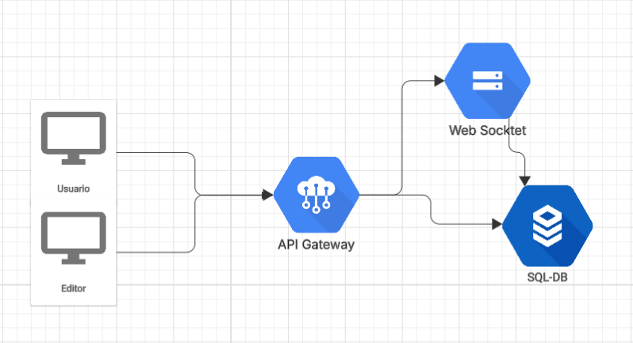
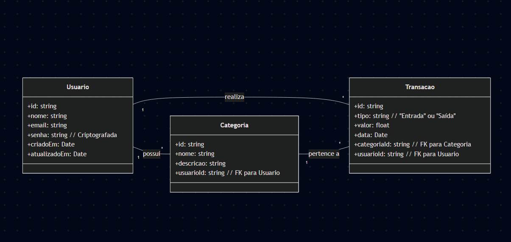

# Introdução

Nos últimos anos, a administração das finanças pessoais tornou-se uma prioridade crescente, especialmente à medida que as pessoas buscam maior controle sobre seus ganhos e despesas. Com a complexidade crescente da vida financeira, o uso de ferramentas digitais para planejamento orçamentário tem se tornado cada vez mais comum. A digitalização acelerada e os impactos da pandemia impulsionaram a adoção de soluções tecnológicas para gestão financeira, aumentando a demanda por aplicativos e plataformas que sejam acessíveis, simples e eficientes, atendendo às necessidades de diferentes perfis de usuários.

O setor de aplicativos financeiros tem registrado um crescimento expressivo, oferecendo diversas soluções para controle de despesas, investimentos e planejamento financeiro. No entanto, muitos desses aplicativos ainda não proporcionam uma experiência totalmente intuitiva e integrada, dificultando a análise detalhada das finanças pessoais. Diante desse cenário, há uma demanda por uma plataforma que alie praticidade, funcionalidade e personalização, permitindo que os usuários registrem suas transações e acessem relatórios detalhados de maneira simples e ágil, otimizando o gerenciamento do seu dinheiro.

## Problema

A organização de tarefas e compromissos diários é um desafio comum para muitas pessoas, especialmente aquelas que possuem rotinas agitadas. A falta de planejamento e a dificuldade em acompanhar prazos podem resultar em atrasos, esquecimentos e baixa produtividade. Apesar da existência de diversas ferramentas de gestão de tempo, muitas delas são complexas ou pouco intuitivas, dificultando a adoção por usuários que buscam soluções mais simples e eficazes.

## Objetivos

Objetivo Geral:
Desenvolver um software para gerenciamento de tarefas que auxilie os usuários na organização do seu dia a dia, aumentando sua produtividade e controle sobre compromissos.

Objetivos Específicos:

Criar uma interface amigável que permita aos usuários cadastrar, editar e visualizar suas tarefas de forma simplificada.

Desenvolver uma API robusta utilizando Node.js para armazenamento seguro de informações.

Implementar recursos como lembretes e categorização de tarefas para melhor organização.

Garantir a acessibilidade e responsividade da plataforma para diferentes dispositivos.

## Justificativa

A falta de planejamento e organização impacta diretamente a produtividade das pessoas, levando a atrasos e perda de compromissos importantes. Estudos apontam que indivíduos que utilizam ferramentas de gestão de tempo conseguem otimizar suas atividades em até 30%. No entanto, muitas soluções existentes são complexas e não atendem às necessidades de usuários que buscam praticidade. Dessa forma, um aplicativo simples e eficiente para gestão de tarefas pode trazer benefícios significativos para diferentes perfis de usuários.

## Público-Alvo

O Cash Control é voltado para universitários que precisam gerenciar melhor suas finanças e para adultos entre 18 e 35 anos que buscam um controle mais eficiente de seus gastos e receitas.
A plataforma oferece uma solução intuitiva e acessível para ajudar esses usuários a organizar suas transações, estabelecer metas financeiras e acompanhar seus hábitos de consumo de forma prática e personalizada.

# Especificações do Projeto

O Cash Control é uma plataforma de gerenciamento financeiro que permite aos usuários registrar, categorizar e acompanhar suas transações financeiras de forma intuitiva. 
Entre suas principais funcionalidades, estão o cadastro e autenticação de usuários, o controle de receitas e despesas, a geração de relatórios personalizados e a visualização de tendências financeiras para uma gestão mais eficiente.
Por meio dessa abordagem estruturada, o Cash Control visa oferecer uma ferramenta prática e confiável para que universitários e jovens adultos possam organizar melhor suas finanças e tomar decisões financeiras mais conscientes.

## Personas

Lucas, 28 anos, programador freelancer
Lucas trabalha por conta própria e recebe pagamentos irregulares. Ele precisa de um aplicativo que permita cadastrar receitas e despesas de forma rápida, categorizando-as para entender seu fluxo de caixa mensal.

Ana, 22 anos, universitária
Ana recebe uma mesada dos pais e tem um estágio remunerado. Seu desafio é controlar os gastos para não ficar sem dinheiro antes do fim do mês. Ela busca um aplicativo simples para acompanhar sua renda e despesas.

## Histórias de Usuários

Com base na análise das personas forma identificadas as seguintes histórias de usuários:

|EU COMO... `PERSONA`| QUERO/PRECISO ... `FUNCIONALIDADE` |PARA ... `MOTIVO/VALOR`                 |
|--------------------|------------------------------------|----------------------------------------|
|Usuário do sistema  | Cadastrar minhas receitas e despesas | Controlar melhor minhas finanças     |
|Usuário do sistema  | Categorizar minhas transações      | Facilitar a análise dos meus gastos    |
|Usuário do sistema  | Gerar relatórios financeiros       | Acompanhar meu fluxo de caixa mensal   |
|Usuário do sistema  | Definir metas de economia          | Melhoror planejamento para planos futuros  |
|Usuário do sistema  | 	Acessar a aplicação em diferentes dispositivos   | Ter flexibilidade e praticidade           |
|Administrador       | Monitorar registros do sistema     | Garantir a integridade dos dados       |

## Requisitos

As tabelas que se seguem apresentam os requisitos funcionais e não funcionais que detalham o escopo do projeto.

### Requisitos Funcionais

|ID    | Descrição do Requisito  | Prioridade | 
|------|-----------------------------------------|----| 
|RF-001| O sistema deve permitir que o usuário crie uma conta e faça login. | ALTA |  
|RF-002| O sistema deve permitir que o usuário altere seus dados cadastrais   | ALTA | 
|RF-003| O sistema deve permitir o cadastro, edição e exclusão de receitas e despesas.   | ALTA |  
|RF-004| O sistema deve permitir que o usuário categorize as transações (alimentação, lazer, contas etc.).  | ALTA | 
|RF-005| O sistema deve exibir um histórico das transações cadastradas, permitindo a filtragem por período, categoria ou tipo.   | MÉDIA |
|RF-006| O sistema deve gerar relatórios financeiros mensais e anuais.   | ALTA | 
|RF-007| O sistema deve permitir que o usuário configure metas financeiras, como limite de gastos mensais por categoria.   | MÉDIA | 
|RF-008| O sistema deve exibir o saldo e gasto diário sugerido.   | MÉDIA | 
|RF-009| O usuário pode configurar notificações sobre gastos acima do orçamento.  | BAIXA | 
|RF-010| O usuário pode exportar relatórios em PDF ou CSV.   | MÉDIA | 

### Requisitos não Funcionais

|ID     | Descrição do Requisito  |Prioridade |
|-------|-------------------------|----|
|RNF-001| A aplicação deve ser responsiva para funcionar em diferentes dispositivos. | ALTA | 
|RNF-002| O tempo de resposta do sistema deve ser inferior a 2 segundos. | MÉDIA | 
|RNF-003| Os dados devem ser armazenados de forma segura utilizando criptografia. | ALTA | 
|RNF-004| O sistema deve oferecer autenticação segura. | ALTA | 
|RNF-005| O sistema deve suportar múltiplos usuários simultaneamente. | MÉDIA | 
|RNF-006| O sistema deve suportar pelo menos 10.000 usuários simultâneos sem degradação do desempenho. | MÉDIA | 
|RNF-007| A aplicação deve utilizar um banco de dados otimizado para consultas rápidas de transações financeiras | ALTA | 
|RNF-008| O sistema deve possuir logs detalhados de erros e atividades dos usuários para auditoria. | MÉDIA | 
|RNF-009| A aplicação deve possuir uma interface intuitiva, garantindo que novos usuários possam navegar sem necessidade de treinamento. | ALTA | 
|RNF-010| O sistema deve permitir backup automático dos dados diariamente. | MÉDIA | 
|RNF-011| A aplicação deve estar em conformidade com a LGPD (Lei Geral de Proteção de Dados) e outras normas de privacidade relevantes. | ALTA | 

## Restrições

O projeto está restrito pelos itens apresentados na tabela a seguir.

|ID| Restrição                                                                |
|--|--------------------------------------------------------------------------|
|01| O projeto será utilizado exclusivamente para controle financeiro pessoal |
|02| O sistema será destinado apenas para uso individual                      |
|03| Não haverá integração com instituições bancárias                         |

# Arquitetura da Solução

## Tecnologias Utilizadas

Frontend: Desenvolvido utilizando HTML, CSS e JavaScript para uma interface interativa e acessível.

Gerenciamento de Estado: Armazenamento e manipulação de dados utilizando soluções nativas do JavaScript.

Backend: Desenvolvido em Node.js para manipulação de dados e lógica de negócio.

Banco de Dados: MySQL para armazenamento estruturado de dados financeiros.

Autenticação: Implementada de forma básica com armazenamento de credenciais no banco de dados ou localmente.

## Diagrama de classes

# Planejamento do projeto

##  Divisão de papéis

### Sprint 1
- _Scrum master_: Matheus Felipe
- Protótipos: Michael Pires
- Testes: André Eller
- Documentação: Arthur Parreiras

### Sprint 2
- _Scrum master_: Matheus Felipe
- Desenvolvedor _front-end_: Michael Pires
- Desenvolvedor _back-end_: Arthur Parreiras
- Testes: André Eller

##  Quadro de tarefas

### Sprint 1

Atualizado em: 21/04/2024

| Responsável   | Tarefa/Requisito      | Iniciado em    | Prazo      | Status | Terminado em     |
| :----         |    :----              |      :----:    | :----:     | :----: | :----:           |
| Matheus       | Introdução            | 01/02/2024     | 07/02/2024 | ✔️     | 05/02/2024      |
| Michael       | Objetivos             | 03/02/2024     | 10/02/2024 | 📝     |                 |
| André         | Histórias de usuário  | 01/01/2024     | 07/01/2005 | ⌛     |                 |
| Arthur        | Personas              | 01/01/2024     | 12/02/2005 | ❌     |                 |

### Sprint 2

Atualizado em: 21/04/2024

| Responsável   | Tarefa/Requisito | Iniciado em    | Prazo      | Status | Terminado em    |
| :----         |    :----         |      :----:    | :----:     | :----: | :----:          |
| AlunaX        | Página inicial   | 01/02/2024     | 07/03/2024 | ✔️    | 05/02/2024      |
| AlunaZ        | CSS unificado    | 03/02/2024     | 10/03/2024 | 📝    |                 |
| AlunoY        | Página de login  | 01/02/2024     | 07/03/2024 | ⌛     |                 |
| AlunoK        | Script de login  |  01/01/2024    | 12/03/2024 | ❌    |       |

Legenda:
- ✔️: terminado
- 📝: em execução
- ⌛: atrasado
- ❌: não iniciado

> **Links úteis**:
> - [11 passos essenciais para implantar Scrum no seu projeto](https://mindmaster.com.br/scrum-11-passos/)
> - [Scrum em 9 minutos](https://www.youtube.com/watch?v=XfvQWnRgxG0)
> - [Os papéis do Scrum e a verdade sobre cargos nessa técnica](https://www.atlassian.com/br/agile/scrum/roles)

## Processo

O projeto seguirá a metodologia Scrum, utilizando o GitHub Projects para gestão de tarefas e sprints. O processo envolverá:

Planejamento da Sprint: Definição de tarefas a serem realizadas.

Desenvolvimento: Implementação das funcionalidades conforme backlog.

Revisão e Testes: Validação da implementação.

Entrega e Retrospectiva: Avaliação e melhoria para a próxima sprint.

## Ferramenta

| Ambiente                            | Plataforma                         | Link de acesso                         |
|-------------------------------------|------------------------------------|----------------------------------------|
| Repositório de código fonte         | GitHub                             | http://....                            |
| Documentos do projeto               | GitHub                             | http://....                            |
| Projeto de interface                | Figma                              | http://....                            |
| Gerenciamento do projeto            | GitHub Projects                    | http://....                            |
| Codigo                              | Vs Code                            | http://....                            |
 
